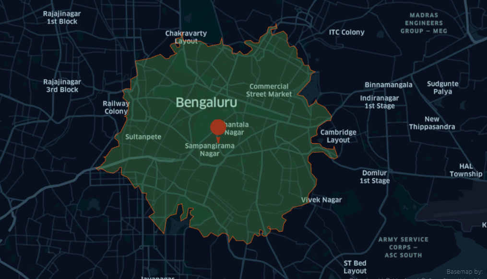
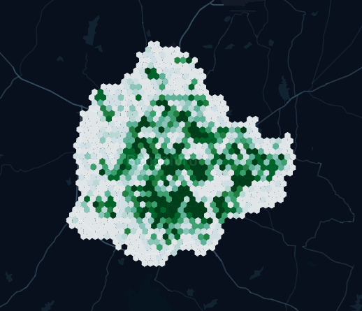

# Product Documentation

## Examples

### 1. Read Infrastructure and Demographic Data inside a custom Polygon

Infrastructure variables include examples such as Restaurants, gyms, Grocery
stores, etc and demographics include variables such as Population and Area of
the given custom polygon. There are a lot of open-sourced tools from where you
can draw a polygon and get its coordinates\(such as
[kepler.gl](https://kepler.gl/) and [geojson.io](https://geojson.io/)\). These
variables help to analyze different prospects of areas of interest.

=== ":octicons-file-code-16: api_request.py"

    ```python
    # Import Libraries
    import requests

    # Define a closed polygon
    data = {
        "coordinates": [
            {"lat": 13.388617618153711, "lng": 77.57514029874933},
            {"lat": 12.81883149952699, "lng": 77.03310705621149},
            {"lat": 12.752539132573569, "lng": 77.59368896484375},
        ],
        "status": "False",
    }
    Base_URL = ""
    response = requests.post(Base_URL + "/post_json", json=data)
    data = response.json()
    print(data)
    ```

=== ":octicons-file-code-16: response.json"

    ```json
    {
      "Area": "2133880086",
      "Demographics": {
        "Female": "3431369",
        "Houses": "2648272",
        "Male": "3050565",
        "Population": "6481934"
      },
      "Infra": {
        "Apartments": "41",
        "Bus Stops": "1079",
        "Cinemas": "124",
        "Colleges": "1977",
        "Grocery_Stores": "505",
        "Gyms": "778",
        "Office Parks": "18",
        "Pan Shops": "399",
        "Police stations": "109",
        "Restaurants": "2061",
        "Sports Club": "28",
        "Warehouse and Godowns": "1707"
      }
    }
    ```

### 2. Find out Reachability from a specific point of location and properties inside the returned contours of polygons

The Isochrone support from our API is intuitive in a way that given a routing
profile you will be able to get the information regarding the "within-reach"
areas. It helps you analyze whether there is a sufficient count of variables of
your interest around you. For eg. You are on a vacation and you want to find out
how many tourist spots or delight restaurants are around your location within
the walking limit.

=== ":octicons-file-code-16: api_request.py"

    ```python
    # Define Imports
    import geopandas as gd
    import pandas as pd
    import requests
    from keplergl import KeplerGl
    from shapely.geometry import Point, Polygon

    # Define the request parameters
    """
    coordinates:Coordinate pair around which to center the isochrone lines.
    contour_minutes:The time in minutes to use for each isochrone contour
    profile:routing profile(driving,walking,cycling)
    """
    payload = {
        "coordinates": "77.5946,12.9716",
        "profile": "cycling",
        "contours_minutes": "15",
    }
    Base_URL = ""
    response = requests.post(Base_URL + "/isochrone_api", json=payload)
    data = response.json()
    coords = [float(i) for i in payload["coordinates"].split(",")]
    columns = ["point_lat", "point_lng", "icon"]
    icon = pd.DataFrame([coords.append("route-dot")], columns=columns)
    isochrone = gd.GeoDataFrame(index=[0], geometry=[Polygon(data["coordinates"])])
    map = KeplerGl(height=500, data={"icon": icon, "isochrone": isochrone})
    map
    print(data["data"])
    ```

=== ":octicons-file-code-16: response.json"

    ```json
    {
      "Demographics": {
        "Female": "4857320",
        "Houses": "3476412",
        "Male": "4379339",
        "Population": "9236659"
      },
      "Infra": {
        "Apartments": "119",
        "Bus Stops": "1850",
        "Cinemas": "207",
        "Colleges": "3667",
        "Grocery_Stores": "1412",
        "Gyms": "1575",
        "Office Parks": "119",
        "Pan Shops": "966",
        "Police stations": "220",
        "Restaurants": "6685",
        "Sports Club": "48",
        "Warehouse and Godowns": "1869"
      }
    }
    ```

=== ":octicons-file-code-16: isochrone.png"

    


### 3. Visualize a Heatmap for your Choice of Variable

Heatmap is a data visualization technique that helps analyze the magnitude of variables of interest. Suppose you are planning to open a restaurant in an area it is good to analyze your competition in different parts of the city.

=== ":octicons-file-code-16: api_request.py"

    ```python
    import requests
    from keplergl import KeplerGl

    args = {"var": "rest_count"}
    Base_URL = ""
    response = requests.get(Base_URL + "/sheatmap", params=args)
    data = response.json()
    heatmap = pd.DataFrame(data)
    map = KeplerGl(height=500, data={"data": heatmap})
    map
    ```

=== ":octicons-file-code-16: heatmap.png"

    
